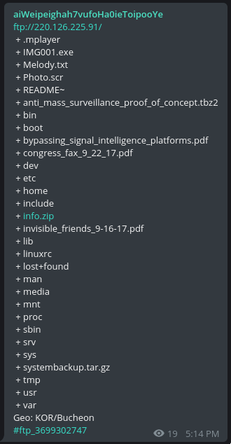
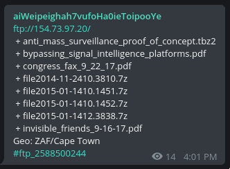
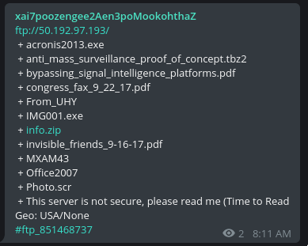

# Michael Guidry

[good evening](https://t.me/good_evening), November 08, 2017

## Zero-Day Attacks..

Between 1998 and 2000, a series of DDoS attacks targeted websites of well-known companies and government organizations (e.g., eBay, CNN, Amazon, FBI, MSN, Yahoo).

The software used for these attacks can now be found by searching for trinoo (Trin00), TFN (Tribe Flood Network), TFN2K (a more advanced version), Stacheldraht (German for "barbed wire").

One of the organizers of the attack was the developer of trinoo, a 13-15-year-old hacker named Michael Guidry, known by the pseudonym phifli (he also uses mikeguidry, mikeg504, but phifli seems to have stuck with him for life).

## .. and their consequences

Attacks on such serious organizations naturally did not go unnoticed by the FBI. Stories vary greatly from one narrator to another, which is not surprising: some materials may be classified, everyone has a subjective view, etc.

For example, one well-known hacker, Mafiaboy (although his reputation is questionable), released a [book](https://www.amazon.com/Mafiaboy-Portrait-Hacker-Young-Man/dp/0762770554)

> Mafiaboy: A Portrait of the Hacker as a Young Man

It contains at least a small piece about Michael:

> Phifli (AKA Mikey) - A serious coder, Phifli didn't bother with the battles; he was all about writing code. At my urging, he would go on to write Trinoo, a denial-of-service tool that was a key inspiration to me when I began working toward my series of major attacks. Although he didn't engage in battle, Phifli loved talking over channels. And he was kind enough to let his fellow TNT members test out his tools. That gave us a big advantage.

During my research, I came across the following comment (can be found on [this](https://webcache.googleusercontent.com/search?q=cache:mvJC71UWDtUJ:https://www.amazon.com/Mafiaboy-Cracked-Internet-Still-Broken/dp/0670067482+&cd=13&hl=ru&ct=clnk&gl=ru) page by searching for phifli) to this book:

> I was an actual member of `tnt/phorce` and I recall things VERY differently. MB asked others to help him packet the sites that were mentioned in the news, and most of them said F' off. Mafiaboy wrote no tools at all, most of any attack programs were written by phifli, sinkhole and a few select others. He did use a semi-public scanner to 'own' machines (solaris boxes, irix) and just either put bots on them, or used them with trinoo. Before trinoo, he simply logged into a bunch of machines and manually [smurf'd](https://en.wikipedia.org/wiki/Smurf_attack) or UDP flooded targets. 
> I think he just wrote this because nobody wants to hire him, and he wanted to make money off of other people's accomplishments. What's sad is he made money off the following people:
> ShadowKnight, phifli, dreamwalk, sinkhole, CORE (group), conflict (group), madcrew (group), NoName (group), chrome (group)
> .. And countless others. By attacking all of those sites, he initially was the result of many people just giving it up (ie: phifli, dreamwalk, myself) because he attracted unwanted attention to the scene. I'm pretty sure Mshadow was the one who leaked the logs of him attacking the sites to the RCMP/FBI and that's what got him busted. There is much hatred towards him for this book, him attacking corporate companies. I showed this book to someone who was around at the same and his jaw dropped as the BS that is in this book.
> Also, the media portrays MB as some superhacker. HAH. Far from it, he's a victim of the public's stupidity.

An article dedicated to the attacks (2002): https://www.cnet.com/news/hacker-discloses-new-internet-attack-software/

[Some](https://en.wikipedia.org/wiki/Trinoo) [information](https://en.wikipedia.org/wiki/Stacheldraht) can also be [found](https://en.wikipedia.org/wiki/Tribe_Flood_Network) on Wikipedia and just on the internet.

[Here](https://www-uxsup.csx.cam.ac.uk/pub/webmirrors/www.cert.org=/incident_notes/IN-99-04.html) and [here](https://www.cert.org/historical/advisories/CA-1999-05.cfm?) you can learn a bit more about how the attack was carried out technically.

In any case, all the stories differ somewhat from source to source, and even this text is just an average of what was found over a couple of days.

## The Beginning

On 06.11.17 at 17:14 MSK, a post appeared on the [FTP channel of a bot scanner in Telegram](https://t.me/aiWeipeighah7vufoHa0ieToipooYe) with the following content:

The most interesting ones were, of course:
- anti_mass_surveillance_proof_of_concept.tbz2
- bypassing_signal_intelligence_platforms.pdf
- congress_fax_9_22_17.pdf
- invisible_friends_9-16-17.pdf
- systembackup.tar.gz

Opening the first one ([congress_fax](http://mikeguidry.net/releases/congress_complaint_april_2017.pdf)), I skimmed through the text and, somewhat puzzled, clicked on the link at the bottom of the page: http://mikeguidry.net/releases/

> documents released relating to human/civil rights violations in my life, and some vulnerabilities relating to mass surveillance, and a few other things..

## Excavations

Later it turned out that the domains easystyle.org and limittech.net also lead to this server.

The first one is only found in Michael's PDF files, the second one Michael used most often for contact email (mike@easystyle.org, previously phifli@yahoo.com). The latter is mentioned very little, but I managed to find information from the page header, which suggests that Michael apparently intended to sell custom exploits. At the time of writing this post, unfortunately, I can't find a proof link.

In the /releases/ directory on each of the domains, there is a set of PDF files compiled by Michael at different times over the past two years. Some are reflections on cybersecurity, some are paranoid musings about mass surveillance (e.g. [PRISM](http://mikeguidry.net/releases/dying_prism.pdf)).

Briefly summarizing what Michael himself described - in his opinion, he has been persecuted for the last 20 years, raped (!) about 50 (!) times, with the last one being this year.

In addition, he constantly talks about drugs being added to his drinks and food wherever he is. Because of this, it's hard for him to live, and each time the dose, in his opinion, increases.

Another thing that often appears in his writings is the theft of his intellectual property by some billion-dollar companies. Unfortunately, nothing specific could be extracted, so finding out what this software is and whether it actually exists is quite a challenge.

Besides this, I ran a DirBuster on the server, which allowed me to find out not only about the uninteresting /link/ and /ks/, but also about a suddenly very informative letter from Michael to his family. It can be found [here](http://mikeguidry.net/a.txt).

It's worth reading this letter because it has everything to understand what is happening/has happened in Michael's life and his current situation. In addition, a fairly detailed story with descriptions of his travels can be found in [one](http://mikeguidry.net/releases/new_complaint.pdf) of the PDF files.

The most recent document available on Mike's site is [bypassing_signal_intelligence_platforms.pdf](http://mikeguidry.net/releases/bypassing_signal_intelligence_platforms.pdf).

It contains reflections on modern surveillance, how to counter it, etc.

## Surveillance, #AntiSurveillance

The thought of global surveillance obviously no longer leaves Michael's mind, as can be judged from his notes/letters and his Twitter: https://twitter.com/phifli/

Recent posts from there:

> michael guidry‏ @phifli 24 hours ago
> For everyone who thought my attacks against surveillance platforms were theoretical or too hard.. I just accomplished it in a weekend

> michael guidry‏ @phifli Nov 6
> Wait till you guys get sight of what I plan on doing in the future w resources... LOL everything im doing now is a joke in comparison

Recently, Michael has been developing a sort of "surveillance killer" ([github](https://github.com/mikeguidry/clockwork/tree/antisurveillance)). As far as I could understand from everything I've learned during this time, he wants to fight both total control and hackers on the internet (?). If his statements are to be believed, he is ready to put his development into action. Unfortunately, I didn't have time to understand the principle of operation or read the code, and reading someone else's (albeit undoubtedly high-quality) C++ code is quite a challenging task.

The site and documents were just the first find (the second after finding that FTP server, which has nothing else interesting).

Here are a few unsorted links that I saved for myself during the search; these could be blog pages with mentions or messages from phifli or something else:

- https://myspace.com/phifli/
- http://prism.euwatch.eu/2437597877.html
- https://marc.info/?l=darklab&m=128924694300949&w=2
- https://gbatemp.net/threads/switch-hacking-homebrew-discussion.464282/page-9
- https://github.com/mikeguidry/
- http://infobot.sourceforge.net/snapshots/url/snapshot_19991218/url-is-final.txt
- https://publicdbhost.dmca.gripe/random/DigitalGangster.com%202016.txt
- ftp://d.easystyle.org/

And here are some data about Michael. However, all this can easily be found on the internet:
- Lived in Tennessee, LA, Florida, Texas, Louisiana, as well as Dubai, Australia, Germany, UAE. Currently resides in Miami (presumed address: Miami 45 SW, 24th Rd, Miami, FL, 33129-1509)
- Only the year of birth is reliably known - 1985. The full date might be 31.07.1985

## a little bit about FTP

During the preparation of the material, another server appeared on the FTP channel:

And later another one was found there:

Given this and the fact that Michael intended to act by all possible means, perhaps this is how he wants to tell everyone about himself.

> The whole point is that since crimes continue to be committed against me I have decided to release information to cause entire different parts of this, and other governments to bat their eyebrows.  I am absolutely positive it has worked although I am still being drugged.  I will continue to exponentially increase the stakes while this continues to take place in my life.

Translation:
> The whole point is that since crimes continue to be committed against me, I have decided to release information to cause a stir everywhere, and other governments to be stunned. I am absolutely sure it worked, although I am still being drugged. And I will continue to exponentially increase the stakes while this is part of my life.

As for the very first one - using only open (almost the entire file system!) data, I found out that there is a user www (ftp://220.126.225.91/etc/passwd) and that he has an empty password. This allowed me to connect to the server remotely, but I didn't find anything particularly interesting there. And due to the legacy state of the SSH server on this machine, I had to tinker with the connection, and the command looks like

> ssh www@220.126.225.91 -oKexAlgorithms=+diffie-hellman-group1-sha1 -c aes128-cbc

By the way. Instead of a server, some embedded solution is used, which is obvious from the contents of the directories. I looked at ftp://220.126.225.91/etc/hostname and [googled it](http://www.northstarmicro.com/undefined-category/miscellaneous4/at91sam9m10-ekes).

Although searches in this direction yielded nothing (besides - what if he really spreads everything in such a "viral" way?), it was quite interesting.

## Conclusion

In general, this is all I managed to find in one evening.

Once again, a list of what you can read about this whole story:
- Letter to the family: http://mikeguidry.net/a.txt
- Letter to embassies: http://mikeguidry.net/releases/new_complaint.pdf
- Twitter: https://twitter.com/phifli/
- GitHub: https://github.com/mikeguidry/

Prepared in collaboration with the [@netstalking](https://t.me/netstalking) community.
