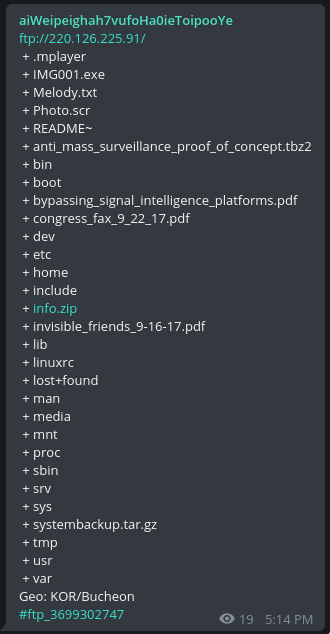

# Michael Guidry

[dobbry vechur](https://t.me/good_evening), 8 listopada 2017

## Ataki z lat 2000..

W okresie od 1998 do 2000 roku miała miejsce seria ataków DDoS na strony internetowe znanych firm i organizacji rządowych (np. eBay, CNN, Amazon, FBI, MSN, Yahoo).

Oprogramowanie używane do tych ataków można teraz znaleźć pod nazwami trinoo (Trin00), TFN (Tribe Flood Network), TFN2K (bardziej zaawansowana wersja), Stacheldraht (niem. "drut kolczasty").

Jednym z organizatorów ataku był twórca trinoo, 13-15-letni haker Michael Guidry, znany pod pseudonimem phifli (obecnie używa również mikeguidry, mikeg504, ale phifli wydaje się być z nim na zawsze).

## .. i ich konsekwencje

Ataki na tak poważne organizacje oczywiście nie uszły uwadze FBI. Historie są bardzo różne w zależności od opowiadającego, co nie jest zaskakujące: niektóre materiały mogą być utajnione, każdy ma subiektywny punkt widzenia itd.

Na przykład, jeden z znanych hakerów Mafiaboy (choć jego reputacja jest wątpliwa) wydał [książkę](https://www.amazon.com/Mafiaboy-Portrait-Hacker-Young-Man/dp/0762770554)

> Mafiaboy: A Portrait of the Hacker as a Young Man

W niej jest przynajmniej mały fragment o Michaelu:

> Phifli (AKA Mikey) - Poważny programista, Phifli nie przejmował się bitwami; chodziło mu tylko o pisanie kodu. Pod moim naciskiem, napisał Trinoo, narzędzie do ataków odmowy usługi, które było dla mnie kluczową inspiracją, gdy zacząłem pracować nad moją serią dużych ataków. Chociaż nie brał udziału w bitwach, Phifli uwielbiał rozmawiać na kanałach. I był na tyle uprzejmy, że pozwolił swoim kolegom z TNT testować swoje narzędzia. To dało nam dużą przewagę.

Podczas moich poszukiwań natknąłem się na następujący komentarz (można go znaleźć na [tej](https://webcache.googleusercontent.com/search?q=cache:mvJC71UWDtUJ:https://www.amazon.com/Mafiaboy-Cracked-Internet-Still-Broken/dp/0670067482+&cd=13&hl=ru&ct=clnk&gl=ru) stronie, szukając np. phifli) do tej książki:

> Byłem rzeczywistym członkiem `tnt/phorce` i pamiętam wszystko BARDZO inaczej. MB poprosił innych, aby pomogli mu zaatakować strony wspomniane w wiadomościach, a większość z nich powiedziała mu, żeby się odczepił. Mafiaboy nie napisał żadnych narzędzi, większość programów atakujących zostało napisanych przez phifli, sinkhole i kilku innych. Używał półpublicznego skanera do 'przejęcia' maszyn (solaris, irix) i po prostu instalował na nich boty lub używał ich z trinoo. Przed trinoo, po prostu logował się na wiele maszyn i ręcznie przeprowadzał ataki smurf lub zalewał cele ruchem UDP.

> Myślę, że napisał tę książkę, ponieważ nikt nie chce go zatrudnić, a chciał zarobić na osiągnięciach innych ludzi. Smutne jest to, że zarobił na następujących osobach:

> ShadowKnight, phifli, dreamwalk, sinkhole, CORE (group), conflict (group), madcrew (group), NoName (group), chrome (group)

> .. I niezliczonych innych. Atakując te strony, początkowo spowodował, że wiele osób po prostu zrezygnowało (np. phifli, dreamwalk, ja sam), ponieważ przyciągnął niechcianą uwagę do sceny. Jestem prawie pewien, że to Mshadow wyciekł logi jego ataków na strony do RCMP/FBI i to go złapało. Jest wiele nienawiści wobec niego za tę książkę, za jego ataki na korporacyjne firmy. Pokazałem tę książkę komuś, kto był wtedy w pobliżu, a jego szczęka opadła na widok bzdur w tej książce.

> Media przedstawiają MB jako jakiegoś superhakera. HAH. Daleko mu do tego, jest ofiarą głupoty publicznej.

## Początek

06.11.17 o 17:14 MSK na [kanale FTP bota-skanera na Telegramie](https://t.me/aiWeipeighah7vufoHa0ieToipooYe) pojawił się post o następującej treści:

Najbardziej interesujące wydawały się oczywiście:

- anti_mass_surveillance_proof_of_concept.tbz2
- bypassing_signal_intelligence_platforms.pdf
- congress_fax_9_22_17.pdf
- invisible_friends_9-16-17.pdf
- systembackup.tar.gz

Otworzyłem pierwszy z brzegu ([congress_fax](http://mikeguidry.net/releases/congress_complaint_april_2017.pdf)), przejrzałem tekst i z pewnym zdziwieniem po przeczytaniu kliknąłem na link na dole strony: http://mikeguidry.net/releases/

> dokumenty dotyczące naruszeń praw człowieka/cywilnych w moim życiu oraz niektóre luki związane z masową inwigilacją i kilkoma innymi rzeczami..

## Wykopaliska

Później okazało się, że do tego samego serwera prowadzą domeny easystyle.org i limittech.net

Pierwsza pojawia się tylko w plikach pdf Michaela, drugą Michael najczęściej używał do kontaktu mailowego (mike@easystyle.org, wcześniej phifli@yahoo.com). Ostatnia jest bardzo mało wspomniana, ale udało mi się znaleźć informacje o tytule strony, z którego wynika, że Michael najwyraźniej zamierzał sprzedawać własne exploity. W momencie pisania tego posta, niestety, nie udało się znaleźć linku dowodowego.

W katalogu /releases/ na każdej z domen dostępny jest zestaw plików pdf, sporządzonych przez Michaela w różnym czasie w ciągu ostatnich dwóch lat. Część to rozważania na temat cyberbezpieczeństwa, część to paranoiczne rozważania o powszechnej inwigilacji (np. [PRISM](http://mikeguidry.net/releases/dying_prism.pdf))

Krótko streszczając to, co opisał sam Michael - jego zdaniem, przez ostatnie 20 lat był prześladowany, gwałcony (!) około 50 (!) razy, a ostatni raz miał miejsce w tym roku.

Ponadto, ciągle mówi o tym, że gdziekolwiek by nie był, do jego napojów i jedzenia dodawane są narkotyki. Z tego powodu trudno mu żyć, za każdym razem dawka według niego się zwiększa.

Kolejną rzeczą, która często pojawia się w jego zapiskach, jest kradzież jego własności intelektualnej przez niektóre firmy o miliardowych majątkach. Niestety, nie udało się wyłapać niczego konkretnego, więc dowiedzenie się, co to za oprogramowanie i czy naprawdę istnieje, jest dość trudnym zadaniem.

Oprócz tego, przeskanowałem serwer za pomocą DirBuster, co pozwoliło mi dowiedzieć się nie tylko o nieinteresujących /link/ i /ks/, ale także o nagle bardzo informacyjnym liście Michaela do swojej rodziny. Można go znaleźć [tutaj](http://mikeguidry.net/a.txt).

Warto przeczytać ten list, ponieważ zawiera wszystko, co trzeba wiedzieć, aby zrozumieć, co dzieje się/działo się w życiu Michaela i w jakiej sytuacji się znajduje. Ponadto, dość szczegółowy opis jego podróży można znaleźć w [jednym](http://mikeguidry.net/releases/new_complaint.pdf) z plików PDF.

Najbardziej aktualny dokument dostępny na stronie Mike'a to [bypassing_signal_intelligence_platforms.pdf](http://mikeguidry.net/releases/bypassing_signal_intelligence_platforms.pdf)

Zawiera on rozważania na temat współczesnej inwigilacji, jak można jej przeciwdziałać itp.

## Inwigilacja, #AntiSurveillance

Myśl o globalnej inwigilacji, oczywiście, nie opuszcza głowy Michaela, o czym można sądzić zarówno z jego notatek/listów, jak i z jego Twittera: https://twitter.com/phifli/

Ostatnie wpisy stamtąd:

> michael guidry‏ @phifli 24 hours ago

> For everyone who thought my attacks against surveillance platforms were theoretical or too hard.. I just accomplished it in a weekend

Tłumaczenie:

> Dla wszystkich, którzy myśleli, że moje ataki na systemy inwigilacji to tylko teoria lub coś niemożliwego... Właśnie to osiągnąłem w weekend.

> michael guidry‏ @phifli Nov 6

> Wait till you guys get sight of what I plan on doing in the future w resources... LOL everything im doing now is a joke in comparison

Tłumaczenie:

> Poczekajcie, aż zobaczycie, co planuję zrobić w przyszłości z zasobami... LOL, wszystko, co robię teraz, to żart w porównaniu z tym, co nadchodzi.

Ostatnio Michael pracował nad czymś w rodzaju "zabójcy inwigilacji" ([github](https://github.com/mikeguidry/clockwork/tree/antisurveillance)). Na ile udało mi się zrozumieć z tego, co dowiedziałem się w tym czasie, chce walczyć zarówno z totalną kontrolą, jak i z hakerami w internecie (?). Jeśli wierzyć jego oświadczeniom, jest gotów wprowadzić swoje rozwiązanie do walki. Nie miałem czasu, aby zrozumieć zasadę działania lub przeczytać kod, a czytanie cudzego (choć niewątpliwie wysokiej jakości) kodu w C++ to dość trudne zadanie.

Strona i dokumenty były tylko pierwszym znaleziskiem (drugim po znalezieniu tego serwera FTP, na którym nie ma już nic interesującego).

Oto kilka niesortowanych linków, które zapisywałem dla siebie podczas poszukiwań, mogą to być strony z blogów z wzmiankami lub wiadomościami samego phifli lub coś innego:

- https://myspace.com/phifli/
- http://prism.euwatch.eu/2437597877.html
- https://marc.info/?l=darklab&m=128924694300949&w=2
- https://gbatemp.net/threads/switch-hacking-homebrew-discussion.464282/page-9
- https://github.com/mikeguidry/
- http://infobot.sourceforge.net/snapshots/url/snapshot_19991218/url-is-final.txt
- https://publicdbhost.dmca.gripe/random/DigitalGangster.com%202016.txt
- ftp://d.easystyle.org/

A tutaj nawet jakieś dane o Michaelu. Jednak wszystko to można łatwo znaleźć w internecie:

- Mieszkał w stanach Tennessee, LA, Floryda, Teksas, Luizjana, oprócz tego w Dubaju, Australii, Niemczech, ZEA. Obecnie mieszka w Miami (przypuszczalny adres: Miami 45 SW, 24th Rd, Miami, FL, 33129-1509)
- Znany jest tylko rok urodzenia - 1985. Możliwe, że pełna data to 31.07.1985

## trochę osobno o FTP

Podczas przygotowywania materiału na kanale FTP pojawił się kolejny serwer:

A później znaleziono tam jeszcze jeden:

Biorąc pod uwagę to i fakt, że Michael zamierzał działać wszelkimi możliwymi metodami, możliwe, że w ten sposób chce opowiedzieć wszystkim o sobie.

> The whole point is that since crimes continue to be committed against me I have decided to release information to cause entire different parts of this, and other governments to bat their eyebrows.  I am absolutely positive it has worked although I am still being drugged.  I will continue to exponentially increase the stakes while this continues to take place in my life.

Tłumaczenie:

> Cała sprawa polega na tym, że ponieważ [rząd] nadal popełnia przestępstwa przeciwko mnie, postanowiłem opublikować informacje, aby wzbudzić sensację wszędzie, a inne rządy - osłupieć. Jestem absolutnie pewien, że to zadziałało, chociaż nadal podają mi narkotyki. I będę nadal wykładniczo zwiększać stawki, dopóki to będzie częścią mojego życia.

Jeśli chodzi o pierwszy serwer - używając tylko otwartych (praktycznie cała struktura plików!) danych, dowiedziałem się, że jest tam użytkownik www (ftp://220.126.225.91/etc/passwd) i że ma puste hasło. To pozwoliło mi połączyć się z serwerem zdalnie, ale nie znalazłem tam nic szczególnie interesującego. A z powodu stanu legacy serwera SSH na tej maszynie musiałem się trochę pomęczyć z połączeniem, w końcu komenda wygląda tak:

> ssh www@220.126.225.91 -oKexAlgorithms=+diffie-hellman-group1-sha1 -c aes128-cbc

Tak, przy okazji. Zamiast serwera używane jest jakieś rozwiązanie embedded, co jest oczywiste po zawartości katalogów. Sprawdziłem ftp://220.126.225.91/etc/hostname i wpisałem go w [Google](http://www.northstarmicro.com/undefined-category/miscellaneous4/at91sam9m10-ekes).

Mimo że poszukiwania w tym kierunku nic nie dały (a co, jeśli naprawdę wszystko rozpowszechnia w taki "wirusowy" sposób?), było to dość interesujące.

## Podsumowanie

W zasadzie to wszystko, co udało mi się znaleźć w jeden wieczór.

Jeszcze raz lista tego, co można przeczytać o całej tej historii:

- List do rodziny: http://mikeguidry.net/a.txt
- List do ambasad: http://mikeguidry.net/releases/new_complaint.pdf
- Twitter: https://twitter.com/phifli/
- GitHub: https://github.com/mikeguidry/

przygotowane wspólnie ze społecznością [@netstalking](https://t.me/netstalking)
